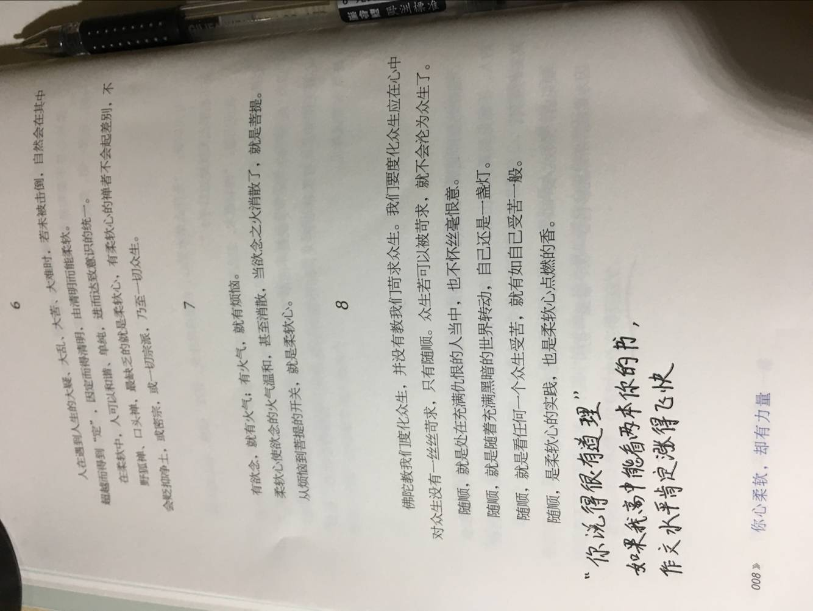

林清玄著的《你心柔软，却有力量》，看了一章以后大失所望。

本来是听多了大名，以前没读过，趋着拜读的心去读的。但是一章过后，很心痛。本来就是一本鸡汤文，喝的我实在很不是滋味，就拿出来说一说。

### 行文不自然
猛灌鸡汤，什么东西都要扯到心灵柔软上边去，给人的感觉就是生编硬凑

### 大道理讲的像模像样
字里边全是佛陀、野狐禅、口头禅、密宗、菩提之类的大象之物，借这些告诉你要随顺。作者凑字数凑到随顺了，读者却一点都不随顺，满脸懵逼。

### 华美的辞藻
金玉其外，败絮其中。辞藻再华丽，写的东西懵懵懂懂，为了追求语句优美，却忘了写书的目的是什么。作者这是在写高中作文？
我要是高中老师，我看了你这第一章，60 分的作文我给你打个满分也是正常。

这种鸡汤文读的让人很不顺畅，心中郁结，就来吐槽几句。

身为记者，不去报道事实真相，却总是追逐花边新闻，这是失职；身为作者，写书的目的却让人不知所云，只顾追求个人的精神境界，是为失德。

许是我没达到林先生的境界，读不懂。我是个现实主义者，林先生的书以后不再碰。

附图：

